# 知识图谱

## 核心主题

### [[01-向量检索与RAG]]
- **向量索引算法**：[[01-向量检索与RAG#HNSW(Hierarchical Navigable Small World)]]、[[01-向量检索与RAG#IVF(Inverted File Index)]]、[[01-向量检索与RAG#HNSW vs IVF（工程选择）]]
- **向量数据库**：[[01-向量检索与RAG#主流向量数据库（Chroma → Qdrant）]]、[[01-向量检索与RAG#集合（collection）]]、[[01-向量检索与RAG#点 = 一行记录(PointStruct)]]
- **混合检索**：[[01-向量检索与RAG#Hybrid Search（混合检索）]]、[[01-向量检索与RAG#RRF（融合策略）]]、[[01-向量检索与RAG#什么时候必须用 Hybrid]]
- **相似度度量**：[[01-向量检索与RAG#余弦相似度：为何「去掉长度、只比夹角」仍常合理]]、[[01-向量检索与RAG#常用相似度 / 距离（向量检索侧）对比]]
- **RAG 框架**：[[01-向量检索与RAG#LlamaIndex]]、[[01-向量检索与RAG#三种切分策略调试与结果对照]]、[[01-向量检索与RAG#数据流]]

### [[02-Agent架构与上下文管理]]
- **Claude Code 架构解析**：[[02-Agent架构与上下文管理#QueryEngine]]、[[02-Agent架构与上下文管理#AppState]]、[[02-Agent架构与上下文管理#Context]]、[[02-Agent架构与上下文管理#Plan Mode]]、[[02-Agent架构与上下文管理#MCP]]
- **上下文压缩**：[[02-Agent架构与上下文管理#上下文压缩（context compression）]]、[[02-Agent架构与上下文管理#Structured Memory（结构化记忆）]]、[[02-Agent架构与上下文管理#Sliding Window + Compression（滑动窗口 + 压缩）]]、[[02-Agent架构与上下文管理#Retrieval + Embedding（检索 + 嵌入）]]、[[02-Agent架构与上下文管理#Programmatic Compression（程序化压缩）]]

### [[03-CLI工具接口与编排工程]]
- **CLI 设计**：[[03-CLI工具接口与编排工程#Click包]]、[[03-CLI工具接口与编排工程#CLI 要获取哪些数据流]]
- **工程哲学与实践**：[[03-CLI工具接口与编排工程#Unix 哲学(可应用在项目)]]、[[03-CLI工具接口与编排工程#标准输入输出：接口即契约]]、[[03-CLI工具接口与编排工程#上下文管理 - Context Management]]、[[03-CLI工具接口与编排工程#冒烟测试]]、[[03-CLI工具接口与编排工程#git测试]]
- **上下文管理策略**：[[03-CLI工具接口与编排工程#三层分工]]、[[03-CLI工具接口与编排工程#ContextState 如何演进]]、[[03-CLI工具接口与编排工程#模型侧「上下文」内容]]、[[03-CLI工具接口与编排工程#Token 相关策略]]
- **贪心与压缩**：[[03-CLI工具接口与编排工程#贪心（MVP做优先级截断）]]、[[03-CLI工具接口与编排工程#折叠化/摘要式压缩]]
- **工具权限模型**：[[03-CLI工具接口与编排工程#工具权限]]、[[03-CLI工具接口与编排工程#为什么规则匹配在分类器之前？]]、[[03-CLI工具接口与编排工程#为什么Bash分类器是两阶段(正则+AI)而不是纯AI？]]
- **推理引擎**：[[03-CLI工具接口与编排工程#查询引擎模块（InferenceEngine）]]、[[03-CLI工具接口与编排工程#如何通过工程化手段保证结构化输出]]、[[03-CLI工具接口与编排工程#工具设计]]
- **HTTP 接口**：[[03-CLI工具接口与编排工程#FastAPI 解决 CLI 的什么问题]]、[[03-CLI工具接口与编排工程#src/api/app.py 的核心逻辑]]、[[03-CLI工具接口与编排工程#数据流]]

### [[04-评测黄金集与数据流水线]]
- **黄金集构建**：[[04-评测黄金集与数据流水线#黄金集构建]]、[[04-评测黄金集与数据流水线#LLM硬凑issue]]、[[04-评测黄金集与数据流水线#收紧约束后产出0条fixture]]、[[04-评测黄金集与数据流水线#爬取速度过慢]]、[[04-评测黄金集与数据流水线#评测指标]]
- **沙箱与路径**：[[04-评测黄金集与数据流水线#评测沙箱与路径问题]]、[[04-评测黄金集与数据流水线#error_log 里已记过的经验（评测侧）]]、[[04-评测黄金集与数据流水线#新的路径错误根因]]、[[04-评测黄金集与数据流水线#解决方案]]
- **流水线追踪**：[[04-评测黄金集与数据流水线#输出结果不理想时,如何对数据流水线进行追踪]]、[[04-评测黄金集与数据流水线#一次追踪数据流水线解决测试结果不佳的记录]]

### [[05-简历Agent并发容器与安全]]
- **只读工具设计**：[[05-简历Agent并发容器与安全#只读工具]]
- **简历 Agent 结构**：[[05-简历Agent并发容器与安全#简历agent结构]]
- **并发控制**：[[05-简历Agent并发容器与安全#LLM并发控制]]、[[05-简历Agent并发容器与安全#asyncio事件循环（Event Loop）]]、[[05-简历Agent并发容器与安全#三种调度方式]]、[[05-简历Agent并发容器与安全#asyncio应用场景(IO密集任务)]]
- **容器化**：[[05-简历Agent并发容器与安全#容器(项目)]]、[[05-简历Agent并发容器与安全#为什么要过滤传给容器的环境变量？]]、[[05-简历Agent并发容器与安全#在 Docker 中执行命令时，为什么要避免 shell？]]、[[05-简历Agent并发容器与安全#挂载路径怎么来的？]]
- **PDF 解析**：[[05-简历Agent并发容器与安全#PDF解析]]、[[05-简历Agent并发容器与安全#如何评估PDF解析质量]]
- **安全架构**：[[05-简历Agent并发容器与安全#Agent项目安全隔离]]

### [[06-多Agent与WebChatbot项目知识]]
- **多 Agent 架构决策**：[[06-多Agent与WebChatbot项目知识#多agent架构的评判准则]]、[[06-多Agent与WebChatbot项目知识#真正值得拆的场景]]、[[06-多Agent与WebChatbot项目知识#不适合拆的场景]]、[[06-多Agent与WebChatbot项目知识#工程上的评判准则]]、[[06-多Agent与WebChatbot项目知识#单 Agent + 工具分层 vs 多 Agent]]
- **Web Chatbot 流式输出**：[[06-多Agent与WebChatbot项目知识#Web Chatbot 流式输出]]
- **LLM Wiki 知识库**：[[06-多Agent与WebChatbot项目知识#LLM WIKI]]

## 层次关系

```mermaid
graph TD
  A[AI Agent 学习记录] --> B[向量检索与 RAG]
  A --> C[Agent 架构与上下文]
  A --> D[工具接口与工程编排]
  A --> E[评测与数据流水线]
  A --> F[运行环境与安全]
  A --> G[项目案例]

  B --> B1[向量索引: HNSW / IVF]
  B --> B2[向量数据库: Qdrant / Payload]
  B --> B3[Hybrid Search: BM25 + RRF]
  B --> B4[相似度: Cosine / 点积 / L2]
  B --> B5[RAG 框架: LlamaIndex / Chunking]

  C --> C1[Claude Code 架构]
  C --> C2[上下文压缩: 结构化记忆 / 滑动窗口 / 检索嵌入 / 程序化]
  C --> C3[压缩策略对比: 贪心截断 vs 折叠摘要]

  D --> D1[CLI: Click / 数据流]
  D --> D2[工程哲学: Unix 哲学 / 契约式 IO]
  D --> D3[上下文管理: 三层分工 / Token 预算]
  D --> D4[工具权限: 规则优先 + 两阶段分类器]
  D --> D5[InferenceEngine: ReAct 闭环 / 结构化输出]
  D --> D6[HTTP 入口: FastAPI / 数据流]

  E --> E1[黄金集构建: 缺陷来源 / 评测指标 / 踩坑]
  E --> E2[沙箱路径: workspace 隔离 / 绝对路径修复]
  E --> E3[流水线追踪: run_id / tool_feedback 覆写修复]

  F --> F1[并发: asyncio / gather / wait / as_completed]
  F --> F2[容器: 环境过滤 / shell 注入防护 / 挂载映射]
  F --> F3[PDF: 混合流水线 / 质量评估]
  F --> F4[安全: 多层隔离 / 模式隔离 / 命令白名单]

  G --> G1[简历 Agent: 结构 / 数据流]
  G --> G2[Web Chatbot: 流式输出 / Vercel AI SDK]
  G --> G3[LLM Wiki: knowledge grounding / guardrail]
```

