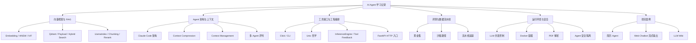

# 知识图谱

## 核心主题
- [[01-向量检索与RAG]]
- [[02-Agent架构与上下文管理]]
- [[03-CLI工具接口与编排工程]]
- [[04-评测黄金集与数据流水线]]
- [[05-简历Agent并发容器与安全]]
- [[06-多Agent与WebChatbot项目知识]]

## 层次关系

```mermaid
graph TD
  A[AI Agent 学习记录] --> B[向量检索与 RAG]
  A --> C[Agent 架构与上下文]
  A --> D[工具接口与工程编排]
  A --> E[评测与数据流水线]
  A --> F[运行环境与安全]
  A --> G[项目案例]

  B --> B1[Embedding / HNSW / IVF]
  B --> B2[Qdrant / Payload / Hybrid Search]
  B --> B3[LlamaIndex / Chunking / Rerank]

  C --> C1[Claude Code 架构]
  C --> C2[Context Compression]
  C --> C3[Context Management]
  C --> C4[多 Agent 评判]

  D --> D1[Click / CLI]
  D --> D2[Unix 哲学]
  D --> D3[InferenceEngine / Tool Feedback]
  D --> D4[FastAPI HTTP 入口]

  E --> E1[黄金集]
  E --> E2[沙箱路径]
  E --> E3[流水线追踪]

  F --> F1[LLM 并发控制]
  F --> F2[Docker 容器]
  F --> F3[PDF 解析]
  F --> F4[Agent 安全隔离]

  G --> G1[简历 Agent]
  G --> G2[Web Chatbot 流式输出]
  G --> G3[LLM Wiki]
```