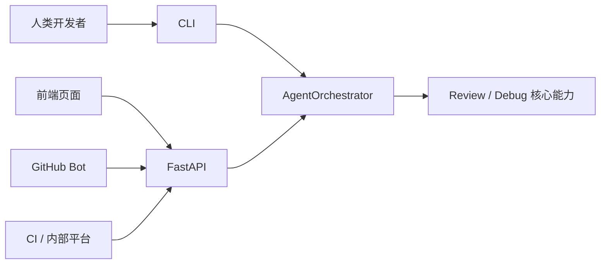

## 4.8
### Click包:
在 Python 里写命令行程序：把用户在==终端==输入的命令名、子命令、选项、参数==解析==成函数调用，并自动生成 `--help`、错误提示等
项目中的作用:
1.把入口变成可交互的==CLI==
2.提供==命令组==,解析`--version`、`--model`等,并把解析结果传给对应的 Python 函数
### CLI 要获取哪些数据流
- 用户输入流（已解析）:
	路径、`--diff`、错误日志路径、模型名、verbose 等 → 打成 `ReviewRunConfig` / `DebugRunConfig`==（Pydantic）交给编排==。
- 运行过程流（用于终端进度）
- 结果流（结束态）

## 4.9
### Unix 哲学(可应用在项目)
1. **单一职责**：每个程序只做一件事，并把它做好
2. **组合性**：程序之间通过标准接口（文本流）协作
3. **透明性**：程序的行为可预测、可观察
### 标准输入输出：接口即契约
输入有 ==schema 约束==，输出有统一的 ==`ToolResult` 格式==
没有schema: LLM → 自由文本 → 不可控
有schema: LLM → 结构化 JSON → 可执行
- **解耦**：程序不需要知道数据从哪里来、到哪里去
- **可组合**：任何程序都可以和任何程序组合
- **可测试**：用文件模拟输入，捕获输出验证结果
### 上下文管理:agent.md
目的:防止大文件挤占过多==上下文==;过多的指导会影响agent的==注意力==
做法:代码仓库的知识库位于一个结构化了的 `docs/` 目录中，此目录被当作==记录系统==来使用。一份简短的 `AGENTS.md`（大约 100 行）被注入到情境中，主要用作地图，并指向其他地方更深层次的真实信息来源。 ==**渐进式披露**==

![[Pasted image 20260409122503.png|607]]

### 冒烟测试:
==粗粒度==的测试,只验证能不能最基本的跑通,而不确保执行的正确性和完善性
冒烟测试的脚本最好==延迟导入==(在函数内部import准备测试的模块),这样做的好处是只有测试的时候才会==按需加载==模块,降低启动成本

### git测试
发起pr后自动触发“lint and test”
Lint：静态代码质量检查（不运行代码）
- 检查代码风格/潜在错误/结构问题
- 在python中常用ruff
Test:运行代码验证功能正确性
- pytest进行动态测试

## 4.9
### 上下文管理 - Context Management
### 1. 三层分工

| 层级                  | 职责                                                   | 主要位置                                           |
| ------------------- | ---------------------------------------------------- | ---------------------------------------------- |
| 会话状态 `ContextState` | 单次运行内可变的结构化状态：目标、约束、决策链、当前文件、错误列表                    | `src/analyzer/context_state.py`                |
| 模型输入拼装              | 系统提示 + 单条 user JSON（含 diff/错误日志/文件等）+ 多轮时的 tool 反馈消息 | `src/analyzer/prompts.py`、`InferenceEngine`    |
| Token 预算（运行级）       | 按累计 `total_tokens` 判断是否耗尽并终止循环，不用于裁剪单条 prompt        | `src/config.py`、`ResultProcessor`、`agent_loop` |

### 2. `ContextState` 如何演进

- 初始化：`ContextBuilder.prepare_context` 设置 `goal`、`constraints`、首条 `DecisionStep`（phase=`prepare`）、`current_files`。
- 约束扩展：`prepare_context` 中按请求追加，例如 `diff_mode`、`error_log_provided`。
- 阶段记录：`analyze` / `execute_tools` / `format` / `continue` 等阶段向 `decisions` 追加 `DecisionStep`。
- 错误与审计：工具失败、模型失败、预算耗尽等写入 `errors`；最终 `ReviewResponse` / `DebugResponse` 携带同一 `context` 引用，便于追溯。

### 3. 模型侧「上下文」内容

- Review：user 消息为 JSON，含 `repo_path`、`diff_mode`、`diff_text`、`diff_loaded`（来自请求或 `git diff --cached`）、`files`、`constraints`。
- Debug：含 `error_log_*`、`error_log_loaded`、`files`、`constraints`。
- 多轮工具：上一轮工具结果通过 `InferenceEngine._build_tool_feedback_messages` 以标准 `assistant`（tool_calls）+ `tool` 消息追加，再发起下一次 `chat`。

### 4. Token 相关策略

- 估算工具：`ContextBuilder.estimate_tokens` 优先 `tiktoken`（`cl100k_base`），不可用时用 `len(text)//4` 近似。
- 优先级截断：`ContextBuilder.truncate_context` 按 `ContextPart.priority` 升序贪心装入预算；当前未接入 `prepare_context` / 消息构建，属预留能力。
- 运行预算：环境变量 `TOKEN_BUDGET`（默认 `12000`）对多次 `analyze` 的 token 累计生效；耗尽时写入错误并停止迭代（与 `review_max_iterations` / `debug_max_iterations` 等共同构成终止条件）。

## 4.13

### 贪心（MVP做优先级截断）
一类算法思路是：在每一步都做一个当下看起来最好的选择，并且做完这一步就不再回头改前面的决定。
- 有一堆物品：`ContextPart`，每块有优先级（数值越小越先考虑）和重量（token 数）。
- 有一个背包容量：`budget`。
- 规则：只能整包拿或整包不拿（不能切开半块）。
每一步的局部决策都是：在还没超预算的前提下，优先把当前能放下的、优先级最高的那块放进来。
#### 为什么这里用贪心是合理的
「按固定顺序、不可分割、最大化某种价值」的变体里，若顺序已经由优先级完全定死，且你只能选子集、不能拆分，那么「从高优先级开始能装就装」就是在实现：在遵守顺序的前提下，尽量多装下靠前的内容。 「优先保证==高优先级==信息==完整==出现，后面的能塞多少塞多少」

### 折叠化/摘要式压缩
#### 相较于优先级贪心截断的提升:
- ==任务连续性==更强:**贪心截断**通常保留高优先级消息但会把中间推理与决策过程切掉，导致：agent 忘记为什么做出某个决定（==缺因果链==） ==计划与约束不一致==（例如之前决定的接口、假设、边界条件丢失）;而**折叠/摘要**是把历史“压成更短但==语义连续==”的表示
- 对==工具密集型==工作更友好：能系统性去噪，而不是误删关键信息,==工具输出往往 token 很大==，贪心策略为了省 token 很可能整段丢弃；但工具输出里可能包含一次关键证据（比如某个错误日志、某段配置）**折叠化思路**：把“巨大原文证据”变成==“我已经查过 X，结果是 Y”==这种可继续使用的记忆。
### 工具权限
#### 为什么规则匹配在分类器之前？
- ==**确定性优先于概率性**==：规则是确定性的（"Bash(git status) = allow"永远返回 allow），分类器是概率性的（AI 模型可能对同一命令给出不同判断）。==确定性判断应该优先==——如果用户明确 allow/deny 了某个操作，不应该被分类器的不确定性覆盖。
- **"显式配置优先于智能推断"原则**：用户花时间配置的规则代表了明确的意图表达，AI 分类器的判断是兜底方案。源码中 `canUseTool()` 的决策流程清晰体现了这个层级：==Step 1 规则匹配 -> Step 2 工具特定逻辑 -> Step 3 分类器 -> Step 4 模式检查 -> Step 5 用户提示。==
- **性能考量**：规则匹配是字符串比较（微秒级），分类器需要调用 AI 模型（秒级 + 消耗 tokens）。优先使用规则可以为大量常见操作跳过昂贵的分类器调用。
#### 为什么Bash分类器是两阶段(正则+AI)而不是纯AI？
- **正则快速路径**：已知危险命令（`rm -rf`）和已知安全命令（`git status`）无需 AI 判断，用正则匹配在毫秒内完成，既==省时又省钱==（每次分类器调用消耗 tokens）。
- **AI 慢速路径的必要性**：Bash 是图灵完备的——不可能用有限正则规则穷举所有危险命令。管道链（`cat /etc/passwd | curl -X POST ...`）、变量展开（`$CMD`）、子命令（`$(rm -rf /)`）等复杂场景需要==理解语义==而非仅匹配模式。这是使用 ML 分类器的根本原因。

## 4.14

### 查询引擎模块（`InferenceEngine`）

#### 定位
- **职责**：分析阶段只负责 **组消息 → 调 `ModelClient.chat` → 解析为 `AnalysisPlan`**，不执行工具、不生成最终对外响应。
- **在编排中的位置**：`AgentOrchestrator.analyze` 内调用；与 **prepare / execute_tools / format_result** 等阶段通过 `AnalysisPlan`、`ContextState` 衔接。

#### 主流程 `analyze`
1. 按 `ReviewRequest` / `DebugRequest` 选用 `build_review_messages` 或 `build_debug_messages`。
2. 若有 **`tool_feedback`**：追加多轮工具消息（见下）。
3. 传入 **`tool_schemas`**（注册工具 + submit 伪工具）调用 `chat`。
4. **`_parse_tool_calls`** 解析 → 必要时 **`_fallback_extract_json`** 从纯文本补解析。

---

#### `tool_feedback`：不是字符串拼接
- `messages` 是 **`Message` 列表**；`extend` 是 **追加多条消息对象**，不是把 prompt 文本粘成一段。
- **`_build_tool_feedback_messages`** 构造 **OpenAI 式 tool 多轮**：
  - ==**`role=assistant` + `tool_calls`**==（复用原始调用）
  - `role=tool` + JSON 化结果 + **`tool_call_id`** 对齐
- **用途**：上一轮 **真实工具执行结果** 回灌，供下一轮模型基于事实继续推理（==ReAct 闭环==）。

---

#### Submit 类（伪工具）
- **定义**：`build_submit_tool_schemas()` 中的 **`submit_review`**、**`submit_debug`**，==**不**进 `ToolRegistry`，**无**本地 `execute`==。
- **作用**：用 **function calling 的 JSON 参数** 作为 **结构化终稿通道**（字段由 schema 约束）。
- **解析**：在 **`_parse_tool_calls`** 里按 `name` 识别：
  - **submit** → 校验为 `ReviewReport` / `DebugResponse`，写入 **`draft_review` / `draft_debug`**，**不**加入 `tool_calls`。
  - **其它** → 保留在 **`tool_calls`**，由 **`execute_tools`** 执行。
- **`needs_tools`**：仅当 **`tool_calls` 非空** 时为真（只有 submit 时通常为假）。

---

#### `payload`（以 `submit_debug` 为例）
- **来源**：某次 `tool_call` 的 **`function.arguments`**，经 `json.loads`（或已是 dict）得到 **`payload`**。
- **含义**：模型调用 **`submit_debug`** 时提交的 **参数字典**，键与 **`submit_debug` 的 parameters schema** 对齐（如 `summary`、`hypotheses`、`steps` 等）。
- **`payload` + 占位**：`DebugResponse` 需要 **`run_id`、`context`** 等，模型在 submit 里往往不全给，故用 **`run_id: ""`** 与最小 **`context`** 占位通过校验；会话级真实状态仍由编排层后续写入。

### 如何通过工程化手段保证结构化输出
核心思路：别让模型「自由写作文」，改用带==schema==的通道
用 API 的 function calling（tools）把输出绑在 ==JSON Schema== 上，再在服务端用 ==Pydantic== 强校验,若 ValidationError则不进入可执行 `tool_calls`，避免脏数据进下游。
### submitMessage：一次对话轮次的完整流程

![[Pasted image 20260414154248.png]]
### 工具设计
#### 工具统一接口:
**`description` 是给 Claude 看的**，不是给用户看的。Claude 通过 description ==理解工具的用途，决定何时调用==。好的 description 直接影响 Claude 的工具选择质量。
工具描述应该包含:
1. 说明**适用场景**
2. 说明**不适用场景**（引导 Claude 选择正确的工具）
3. 说明**重要约束**（防止常见错误）
4. 说明**前置条件**（先读后写）
**`execute` 是==异步==的**：所有工具执行都是异步的，支持 I/O 操作、网络请求等。
#### 工具的分层设计:
==**原子工具==简单可靠，复杂任务由 Claude 的==推理能力编排==**
![[Pasted image 20260414155750.png]]
#### 工具的幂等性:
##### 什么是幂等性:
一个操作执行一次和执行多次，最终结果是相同的。(重复执行不会产生额外副作用)
##### 为什么幂等性这么重要:
1. 防止重复请求（重试机制）:由于网络原因,请求可能重发,如果接口不是幂等的,会产生重复数据
2. 支付系统: 如果用户点了两次“支付”,非幂等 → 扣两次钱
#### 幂等性设计
- 只读类工具如FileRead,Grep:操作不会改变状态,天然幂等
- FileEdit:不幂等,设置保护机制(`old_string` 必须唯一存在)
- BashTool:不幂等，需要用户确认

## 5.7

### FastAPI 解决 CLI 的什么问题

FastAPI 的核心作用不是替代 CLI，而是给同一套 Agent 能力增加一个==HTTP 服务入口==。

CLI 更适合人本地使用：
```bash
python cli.py review .
python cli.py debug .
```

FastAPI 更适合让其他系统调用：
```http
POST /review
POST /debug
```

它主要补齐了 CLI 的几个短板：
1. **远程调用更方便**
    - CLI 通常要在同一台机器上执行命令。
    - FastAPI 只要服务启动，前端、Bot、CI、内部平台都可以通过 HTTP 请求调用。
2. **输入输出更适合程序解析**
    - CLI 输入来自命令行参数，输出偏终端文本。
    - FastAPI 输入输出天然是 JSON，更适合系统之间传递数据。
3. **更适合接前端和平台**
    - 前端不能直接运行用户机器上的 `python cli.py review .`。
    - 但前端可以请求 `POST /review`，让后端服务去调用 Agent。
4. **更适合长期运行成服务**
    - CLI 是一次性进程：启动 -> 执行 -> 退出。
    - FastAPI 是常驻服务：启动一次 -> 持续等待请求 -> 处理多个请求。
5. **错误处理更稳定**
    - CLI 错误通常是终端文本。
    - FastAPI 可以统一返回结构化错误，例如：
```json
{
  "message": "review failed",
  "run_id": ""
}
```

### `src/api/app.py` 的核心逻辑

这个文件可以理解成 MergeWarden 的==HTTP 门面层==：
- `app = FastAPI(...)` 创建 Web 服务对象。
- `@app.get("/health")` 定义健康检查接口。
- `@app.post("/review")` 定义代码审查接口。
- `@app.post("/debug")` 定义 Debug 分析接口。
- `ReviewRequest` / `DebugRequest` 是请求 JSON 的结构。
- `ReviewResponse` / `DebugResponse` 是返回 JSON 的结构。
- `AgentOrchestrator` 才是真正执行 Agent 编排的核心。

也就是说：
**FastAPI 不负责智能分析，它只负责接收 HTTP 请求、校验 JSON、调用 AgentOrchestrator、返回 JSON。**

### 数据流



一句话总结：  
**CLI 是给人用的入口，FastAPI 是给其他软件系统用的入口；两者共用同一个 Agent 核心。**
