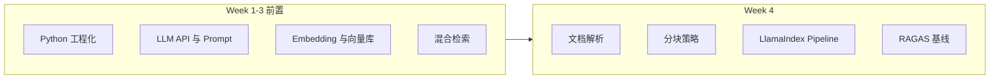

# Week 4 · RAG 第一版与基线评估 — 学习回顾与前置知识

> **学习对齐**：P0 · Week 4 · 贴近 M1（RAG 知识库问答 + 评估基线）  
> **权威对照**：`MultiAgent/学习规划.md` 第一个月 · Week 4

本文档面向「刚开始第四周」的同学：先对齐**本周要做什么**与**第二节「本周学习项目指南」**，再系统串讲**Week 1–3 及 RAG 必备前置**，避免直接上手 LlamaIndex / RAGAS 时概念断层。

---

## 一、第四周：学习内容与本周任务（回顾）

### 1.1 本周学习内容（规划原文要点）

| 主题 | 你要建立的能力 |
| --- | --- |
| **LlamaIndex 完整 RAG Pipeline** | 从「读文档 → 切块 → 建索引 → 检索 → 交给 LLM 生成答案」走通一条可运行链路，并理解各步骤职责。 |
| **文档解析** | PDF：`PyMuPDF`；Word：`python-docx`；多格式：`unstructured`（概念上知道各自适用场景即可）。 |
| **分块策略** | 对比**固定长度**、**语义分块**、**父子分块**对检索与答案质量的影响（第四周核心实验之一）。 |
| **RAGAS 评估** | 至少理解并会使用：**Faithfulness**、**Answer Relevancy**、**Context Recall**，用于建立**可量化的基线**。 |

### 1.2 本周任务（验收导向）

1. 用 **LlamaIndex** 搭建第一个完整 RAG Pipeline，支持 **PDF / Markdown** 导入。  
2. **实现并对比 3 种分块策略**，记录检索质量差异（可用 RAGAS + 小评测集）。  
3. **接入 BM25 + 向量混合检索**（与 Week 3 衔接）。  
4. 用 **RAGAS** 建立评估基线，规划目标示例：**Faithfulness ≥ 0.7**。  
5. 完成 **里程碑 M1** 相关能力铺垫（第一个月末的 RAG 问答 + 评估体系）。

### 1.3 月末自检（与第四周强相关）

- 你的 RAG **Faithfulness** 是多少？**怎么测出来的**？  
- **为什么选这种分块策略**？换一种对 Recall / 噪声 / 延迟有什么影响？  
- **混合检索**相对纯向量，**提升了多少**（最好用同一套评测集上的数字回答）？

---

## 二、本周学习项目指南

回答三件事：**按什么顺序做、代码落在哪里、本周要交付什么**（与「1.2 本周任务」对齐）。

### 2.1 建议推进顺序（由易到难）

| 顺序 | 动作 | 说明 |
| --- | --- | --- |
| 1 | 环境与密钥 | 复用 Week 2：`OPENAI_API_KEY` / 国产模型 key；Embedding 与向量库选型建议与 `embedding_test/zh_retrieval_lab` 一致，便于横向对比。 |
| 2 | 最小 Pipeline | 先 **PDF + Markdown 各 1 份** → Loader → 单一分块 → 向量索引 → Query Engine → 能答再问优化。 |
| 3 | 三种分块对比 | 固定长度 / 语义 / 父子；**同一语料、同一 Embedding、同一 Top-k**，只改 Node Parser，用小评测集记差异。 |
| 4 | 混合检索 | **BM25 + 向量**（如 RRF），衔接 Week 3；融合思路见 `embedding_test/zh_retrieval_lab/hybrid.py` 与该项目 `README.md`。 |
| 5 | RAGAS 基线 | **20～50 条**固定问题集；至少 **Faithfulness、Answer Relevancy、Context Recall**；以规划示例 **Faithfulness ≥ 0.7** 为方向，以可复现为先。 |
| 6 | 收尾 | README：如何建索引、如何跑评测、指标含义；便于月末 **M1** 展示。 |

### 2.2 代码落点

- **推荐**：仓库内 **单独子目录**（如 `RAG_test/week4_rag_lab/`，名称自定），独立依赖说明，避免与 `embedding_test` 实验环境缠在一起。  
- **分工**：`embedding_test/zh_retrieval_lab/` 偏 **检索与混合检索**；Week 4 用 **LlamaIndex 全链路** 建议另起工程，对照第八、九节「解析—分块—索引—检索—生成」分层。  
- **评测集**：`question` / 可选 `ground_truth` 用 JSON 或 CSV；检索到的 `contexts` 可从日志落盘供 RAGAS 使用。

### 2.3 本周交付物（验收）

- [ ] 可运行 **LlamaIndex RAG Pipeline**（PDF + Markdown）。  
- [ ] **三种分块** 对比记录（改了什么 → 指标怎么变）。  
- [ ] **BM25 + 向量** 已接入（或写明框架侧等价实现）。  
- [ ] **RAGAS** 跑分结果至少一份（含 Faithfulness 等）。  
- [ ] README/笔记中写明 **Embedding 模型、Top-k、chunk 参数**，保证可复现。

### 2.4 时间与排障

- **时间**：前段先「能跑、能评」，勿过早上 Reranker 或大重构。  
- **排障**：先区分 **检索未召回** vs **生成不忠实**；日志带 `chunk_id`、检索分数与答案。  
- **成本**：RAGAS 多轮调评判模型，评测集先小后大。

---

## 三、为什么需要前置知识（一张图说清楚）

RAG 不是「调一个 API」单点技能，而是 **检索 + 生成 + 评测** 的流水线：

- **Week 1**：让你能写出**稳定、可测、可重试**的调用代码（后面接 RAGAS、批处理评测时尤其重要）。  
- **Week 2**：RAG 的「生成端」完全依赖 **LLM API** 与 **Prompt/结构化输出**；没有成本与 Token 意识，评测和迭代会失控。  
- **Week 3**：RAG 的「检索端」依赖 **向量** 与 **索引**；Week 4 的混合检索是 Week 3 的直接延伸。  
- **本周**：在工程骨架已具备的前提下，用 **框架（LlamaIndex）** 把流水线产品化，并用 **RAGAS** 把「感觉变好」变成 **指标**。

---

## 四、Week 1 · Python 工程化（前置要点）

### 3.1 asyncio 与并发

- **事件循环**：协程在单线程内协作式调度；适合 **I/O 密集**（等网络、等向量库、等 LLM）。  
- **`asyncio.gather`**：并发发起多个异步任务（例如批量 Embedding、并行检索探针），缩短端到端延迟。  
- **对 Week 4 的意义**：索引构建、评测集批量跑 RAGAS、多文档导入时，异步能显著省时间；读 LlamaIndex 异步 API 时不陌生。

### 3.2 Pydantic v2

- **数据校验**：请求体、配置项、评测记录（question / answer / contexts）用模型描述，减少「字段拼错跑半天」的问题。  
- **对 Week 4 的意义**：封装「一条评测样本」「一次检索结果」等结构，便于日志与复现实验。

### 3.3 结构化错误与重试（如 tenacity）

- LLM 与向量库常见 **429 / 5xx / 超时**；重试 + 退避是基线工程能力。  
- **对 Week 4 的意义**：跑 RAGAS 要多次调用模型，没有重试容易导致评测脚本 fragile。

### 3.4 pytest 与覆盖率

- **Fixture**：准备临时向量库、样例 PDF、假 LLM（Mock）等。  
- **对 Week 4 的意义**：分块策略、混合检索、解析器——**能用同一套测试数据对比前后指标**，避免「改了一处不知道哪坏了」。

### 3.5 结构化日志

- 记录：`trace_id`、文档 id、chunk id、检索分数、所用模型名——后续排查「答案胡扯是因为检索还是生成」会省大量时间。

---

## 五、Week 2 · LLM API 与 Prompt（前置要点）

### 4.1 Chat / Embedding / Streaming / Function Calling

- **Chat**：RAG 最终答案几乎都走对话补全。  
- **Embedding**：Week 3 已实践；Week 4 在 LlamaIndex 里仍会配置同一类接口。  
- **Streaming**：可先不作为 Week 4 硬门槛，但理解 **SSE/流式** 有助于后续 Week 6 服务化衔接。  
- **Function Calling**：Week 4 若做「Agentic RAG」才强依赖；M1 主线以 **检索 + 生成** 为主即可。

### 4.2 tiktoken 与成本意识

- **上下文窗口**有限：分块过大 → 塞不进窗口；过小 → 语义碎片化。  
- **评测成本**：RAGAS 会多次调用评判模型，需控制样本量与模型档位。

### 4.3 Prompt Engineering（与 RAG 直接相关）

- **Few-shot**：稳定输出格式（例如必须引用片段编号）。  
- **CoT**：复杂问题可要求「先根据上下文列要点再作答」（注意延迟与忠实度）。  
- **结构化输出 / JSON**：便于接评估脚本与 UI。

**核心观念**：RAG 的答案质量 = **检索到的上下文是否够用** × **模型是否忠实于上下文**；Prompt 主要约束后者并减少跑题。

---

## 六、Week 3 · 向量数据库与 Embedding（前置要点）

### 5.1 向量检索在干什么

- 文本经 **Embedding 模型**变成 **高维向量**；向量库用 **ANN（近似最近邻）** 找「语义相近」的片段。  
- **直觉**：擅长「意思相近」，对 **专有名词、型号、编号** 有时不如字面匹配。

### 5.2 HNSW / IVF（面试级直觉即可）

- **HNSW**：图索引，速度与精度折中好，常见于 Qdrant 等。  
- **IVF**：聚类分桶，适合大规模数据；先粗筛再精搜。

### 5.3 Embedding 选型（你已在规划里对比过）

- 维度、多语言、中文效果、成本、延迟——Week 4 换分块 / 换 chunk 大小时，**应用同一套 Embedding**，对比才公平。

### 5.4 混合检索：BM25 + 向量（RRF 等融合）

- **BM25**：经典稀疏检索，**关键词**友好。  
- **向量**：**语义**友好。  
- **融合（如 RRF）**：综合两路排序，缓解单一路径短板。  
- **对 Week 4**：规划明确要求本周 **接入混合检索**；仓库中 `embedding_test/zh_retrieval_lab/hybrid.py` 可作为「融合思路」的参考实现（与具体框架集成时 API 不同，但概念一致）。

---

## 七、跨周公共概念：RAG 最小必备术语

| 概念 | 一句话 |
| --- | --- |
| **Indexing** | 把文档加工为可检索结构（chunk + 向量 + 元数据）。 |
| **Chunk / Node** | 检索与喂给模型的最小文本单元；大小与策略影响 Recall 与噪声。 |
| **Retriever** | 给定问题，返回若干 chunk（可能带分数）。 |
| **Top-k** | 取前 k 条；k 大 → 上下文更全但噪声更多、Token 更贵。 |
| **Grounding / Faithfulness** | 答案是否**忠实于**给定上下文（RAGAS 中 Faithfulness 与此强相关）。 |
| **Context Recall** | 回答问题所需的证据，有多少**真的被检索进上下文**（偏检索侧）。 |
| **Answer Relevancy** | 答案与问题的相关度（偏生成侧/整体）。 |

---

## 八、文档解析与分块（第四周「新内容」的前置理解）

### 7.1 解析（Parsing）

- **PDF**：版式复杂，注意表格、多栏、页眉页脚；`PyMuPDF` 常用于提取纯文本。  
- **Markdown**：结构清晰， often 适合作为基线语料。  
- **Word / 杂格式**：`python-docx`、`unstructured` 降低「一种格式一套脚本」的成本。

**要点**：解析质量决定「下游 chunk 是否切断句子、是否混入页脚噪声」。

### 7.2 三种分块策略（你要能对比）

| 策略 | 思路 | 常见代价/收益 |
| --- | --- | --- |
| **固定长度** | 按字符/Token 窗口切，可重叠（overlap） | 实现简单；可能切断语义段落。 |
| **语义分块** | 按语义边界（相似度突变、段落结构）切 | 块更「整句整段」；计算与参数调优成本略高。 |
| **父子分块** | 检索用「小子块」精准命中，返回时带上「父块」扩上下文 | 常改善 Recall 与上下文完整性；索引结构更复杂。 |

**实验心态**：同一套问题集 + RAGAS，只改分块，看 Faithfulness / Context Recall 变化——这就是规划里「记录检索质量差异」的落点。

---

## 九、LlamaIndex 在 Week 4 中的角色（前置心智模型）

不必死记每个类名，先记住 **职责分层**：

1. **Loaders**：读文件 → 文档对象。  
2. **Node Parser / Text Splitter**：切块策略落点。  
3. **Embedding + Vector Store**：写入与查询向量。  
4. **Retriever**：从向量库（及可选 BM25）取上下文。  
5. **Query Engine / Chat Engine**：组装「检索 + Prompt + LLM」。

**与 Week 3 的关系**：Week 3 你更接近「底层拼装」；Week 4 用 LlamaIndex 把这些步骤**标准化**，便于快速试验分块与检索策略。

---

## 十、RAGAS 基线（你要提前知道的）

- **RAGAS 是自动化评估框架**：用（或多用）LLM 作为评判信号，批量给 Faithfulness 等指标打分。  
- **Faithfulness ≥ 0.7** 是规划中的**目标示例**，实际数值依赖语料难度、模型档位与 Prompt；重要的是 **有一套固定评测集 + 可复现脚本**。  
- **基线意识**：任何优化（分块、混合检索、换 Embedding）都应回答：**相对基线变了多少**，而不是只报单次观感。

建议准备一个小型 **黄金评测集**（例如 20～50 条）：每条含 `question`，可选 `ground_truth`；Contexts 可由系统检索日志自动落盘，便于 RAGAS 消费。

---

## 十一、开始第四周前的自检清单

- [ ] 能解释 **Embedding 与向量检索** 的区别与配合方式。  
- [ ] 能说明 **BM25 与向量** 各适合什么查询，为何要做 **混合检索**。  
- [ ] 已为 LLM / Embedding 调用配置 **重试与环境变量**，能用 pytest **Mock** 网络依赖。  
- [ ] 理解 **chunk 过大/过小** 对上下文与 Faithfulness 的影响方向（能用自己的话说明即可）。  
- [ ] 读过 RAGAS 文档中 **Faithfulness / Answer Relevancy / Context Recall** 的定义，知道它们分别偏「检索」还是「生成」。

---

## 十二、参考链接（规划中的延续）

- [LlamaIndex 官方文档](https://docs.llamaindex.ai/) — Understanding / Optimizing  
- [RAGAS 文档](https://docs.ragas.io/) — Metrics 与 Evaluation Pipeline  
- [DeepLearning.AI · Building and Evaluating Advanced RAG](https://www.deeplearning.ai/) — 与 RAGAS、高级 RAG 互补  
- 仓库内对照：`MultiAgent/学习规划.md`（Week 1–4 原文）、`embedding_test/`（向量与混合检索实践）

---

## 学习启示（模拟面试 QA）

**问：第四周和第三周最大的区别是什么？**  
答：第三周侧重「向量与混合检索」底层能力；第四周用 LlamaIndex 把 **解析、分块、索引、检索、生成** 连成产品化 Pipeline，并用 RAGAS 把效果变成 **可对比的指标**，对接 M1。

**问：为什么 Faithfulness 重要？**  
答：它衡量答案是否**忠实于检索上下文**，直接反映 RAG 是否「胡编」；面试时常与「有没有评测集、怎么控制幻觉」一起问。

**问：为什么要做三种分块对比？**  
答：分块决定检索单元语义是否完整，是 P0 里少数「改一处、全局变」的杠杆；用同一评测集对比才能支撑技术选型叙述。

**问：混合检索解决什么问题？**  
答：纯向量对精确词、专有名词、冷僻实体可能弱；BM25 补关键词匹配；融合后常提升 Context Recall 或整体稳定性。

**问：M1 验收里「至少三种格式」和本周任务怎么衔接？**  
答：本周先保证 PDF + Markdown；第三种可在月末前扩展（如 Word），复用同一 Pipeline，只换 Loader 与解析路径。

---

*文档与仓库学习规划对齐；随课程推进可自行在文末追加「本周实验记录」链接。*
